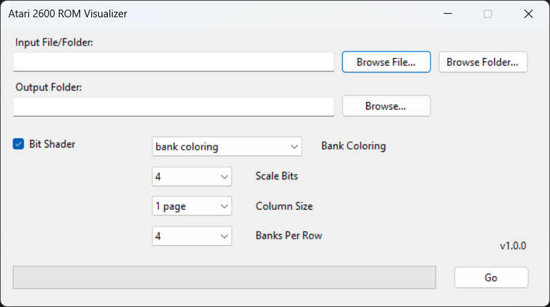

# Atari 2600 ROM Visualizer

Visualizes Atari 2600 ROM data as color-coded images to help understand memory layout and patterns.

Here is a sample visualization of a ROM.

.png)

## Features
- Visualizes .bin and .a26 ROM files
- Supports processing ZIP archives
- Color coding for different ROM banks
- Adjustable scaling and layout options

## Requirements
- Windows OS
- .NET Framework [version]